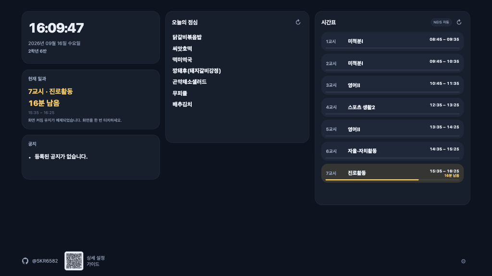
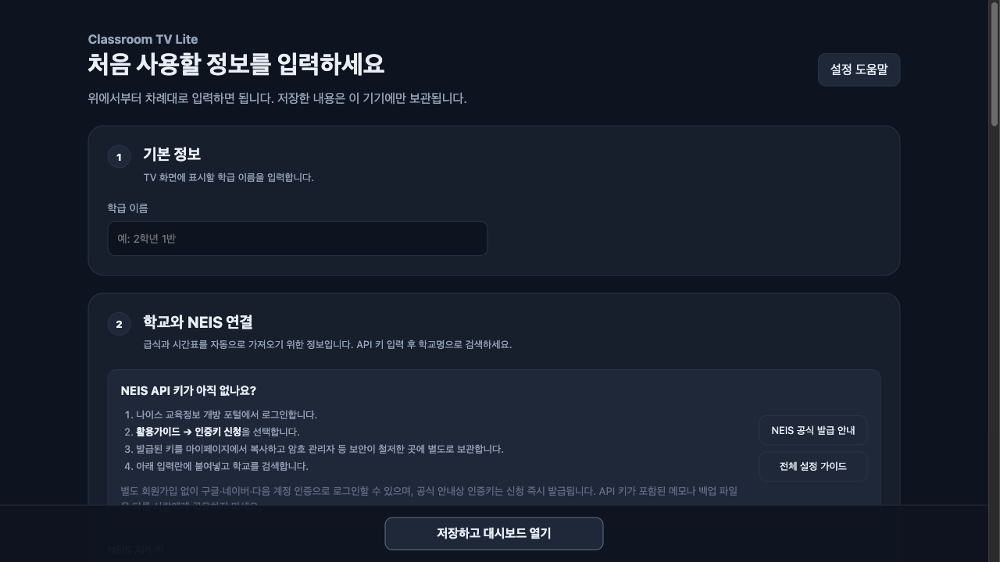

# Classroom TV Lite

Android 공기계에서 Termux로 직접 실행하고, 브라우저 화면을 교실 TV에
16:9로 미러링하는 초경량 대시보드입니다.

## 화면 미리보기

### 16:9 교실 TV 대시보드



### 비개발자용 설정 화면



## 기기별 설치 가이드

- [Android 설치 및 운영 가이드](docs/ANDROID_SETUP.md): Termux 설치, 첫 실행,
  HDMI·무선 미러링, 장시간 운영과 업데이트
- [iPhone·iPad 접속 및 TV 연결 가이드](docs/IOS_SETUP.md): 별도 서버 접속,
  홈 화면 추가, AirPlay·HDMI 연결과 iOS 제약
- [Notion 상세 설정·운영 가이드](https://app.notion.com/p/Classroom-TV-Lite-3dd54b03965e8047b272df3015806757?source=copy_link)

iOS와 iPadOS에서는 서버를 직접 실행하지 않고 Android, Mac, PC 또는 Raspberry Pi에서
실행 중인 서버에 접속합니다.

## 포함 기능

- 초 단위 시계, 현재 교시, 쉬는 시간과 남은 시간
- NEIS 자동 시간표 + 수동 주간 시간표 + 날짜별 보정
- NEIS 오늘의 중식(날짜별 로컬 캐시)
- 한 줄 학급 공지
- 시계·현재 일과·공지·급식·시간표별 글씨 크기 조절
- Screen Wake Lock 자동 재요청
- 웹 초기 설정 및 설정 변경

설정과 API 캐시는 저장소 밖의 `~/.classroom-tv-lite/`에 저장됩니다.

## Termux 설치와 실행

F-Droid 또는 공식 GitHub에서 Termux를 설치한 뒤 아래 명령을 실행합니다.

```bash
pkg update
pkg install git python termux-api
git clone https://github.com/SKR6582/Classroom_TV_Lite.git
cd Classroom_TV_Lite
python -m venv .venv
source .venv/bin/activate
pip install -r requirements.txt
termux-wake-lock
python app.py
```

Chrome 또는 삼성 인터넷에서 <http://localhost:53111>을 엽니다. 최초 실행 시
초기 설정 화면으로 이동합니다.

`localhost`는 브라우저의 안전한 컨텍스트로 취급되므로 HTTPS 인증서 없이
Screen Wake Lock을 사용할 수 있습니다. 안드로이드 설정에서도 Termux와
브라우저를 배터리 최적화 대상에서 제외하는 것을 권장합니다.

## macOS 개발

```bash
python3 -m venv .venv
source .venv/bin/activate
pip install -r requirements.txt
python app.py
```

브라우저에서 <http://localhost:53111>을 엽니다.

## 설정

초기 설정 또는 `/settings`에서 다음 값을 입력합니다.

- NEIS API 키
- 학교명 검색 또는 교육청 코드·표준학교코드 직접 입력
- 학년, 반, 학급 이름
- 교시별 시작·종료 시각
- 월~금 기본 시간표, 한 줄 공지, 선택 사항인 Notion 상세 가이드 주소
- 카드별 글씨 크기(75%~150%)

실제 API 값은 저장소에 포함되지 않습니다. NEIS API 키는 서버의 설정 파일에만
저장되며 브라우저로 다시 전송되지 않습니다.

프로젝트 루트의 `.env`에 `NEIS_API_KEY`, `NEIS_SCHOOL_CODE`,
`NEIS_OFFICE_CODE`를 입력하면 웹 설정값보다 우선합니다. 형식은
`.env.example`을 참고하세요. `.env`는 Git에서 제외됩니다.

설정 화면의 `백업과 도움말` 섹션에서 JSON 백업을 내보내거나 가져올 수 있습니다. API 키는 기본적으로
백업에서 제외되며, 포함 옵션을 직접 선택한 경우에만 저장됩니다. API 키가 들어간
백업 파일은 외부에 공유하지 마세요.

공식 Notion 상세 가이드 주소는 새 설치에 기본 입력되며, 대시보드 하단에 QR 코드로
표시됩니다. 설정에서 주소를 비우면 QR이 숨겨집니다.
프로젝트 문의와 최신 코드는 <https://github.com/SKR6582/Classroom_TV_Lite>에서
확인할 수 있습니다.

## 테스트

```bash
python -m unittest discover -s tests -v
node --test tests/test_time.mjs
```

## 환경 변수

- `CLASSROOM_DATA_DIR`: 설정·캐시 저장 위치 변경
- `CLASSROOM_HOST`: 서버 바인딩 주소(기본 `127.0.0.1`)
- `CLASSROOM_PORT`: 포트(기본 `53111`)
